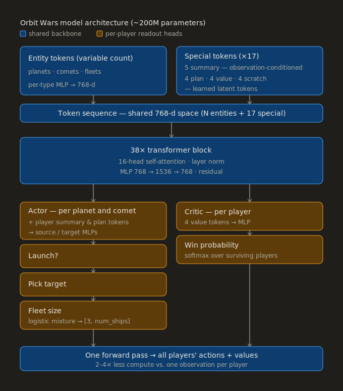

# Scaling Reinforcement Learning to the Stars

## Summary

I trained a single 200-million-parameter transformer for 15 billion steps of self-play reinforcement learning to play both the two-player and four-player modes of Orbit Wars.

## Motivation

For this competition, I set the following goals and constraints for myself:

1. I wanted to try fully agentic software development, so I didn't allow myself to write any code and tried to manually review as little code as possible.
2. I wanted the model to learn as much as possible on its own, so I would use as simple an observation and action space as I could manage while still being competitive. This also meant that I stuck with pure self-play reinforcement learning and avoided any sort of imitation learning initialization.
3. I hypothesized that Sutton's Bitter Lesson would hold: given enough training, a sufficiently expressive large model would outperform a better-engineered small one. Rather than spend my time figuring out elegant domain adaptations for encoding the features, actions, and training algorithm, I worked on pushing the model size as far as I could within the submission constraints.

### Agentic software development

Codex dramatically accelerated the software development process, such that I was able to run preliminary experiments within a couple of weeks. At first, I was still doing some manual review to make sure things remained sensible, but quickly I found myself reviewing only the generated docs to make sure they aligned with my intention.

I should add the caveat that Kaggle competitions are the best-case scenario for this type of experimentation, both generally and specifically. Generally, it’s nice to experiment with new ideas during competitions because the stakes are so low: if you end up with a horrible mess, you can just learn your lessons and discard the codebase entirely. Specifically, a greenfield project with no users, no production system to bring down, no backwards compatibility requirements, and little to no cost for mistakes is an ideal environment to let coding agents rip with minimal human intervention.

While I was impressed with their abilities to implement specifications correctly without (too) much bloat, coding agents' suggestions and creativity often left much to be desired. This approach was an incredible accelerator to the development process, but it was not a substitute for thinking.

### Keeping the observation and action encoding low level

While I considered doing what I’ve done in the past and carefully engineering each feature, input, and action encoding, I was curious to find out how far I could push the performance without any of these crutches for the model, so I started with the lowest level representation that made sense.

* I kept the observation space in its original non-aggregated form: the model saw only a collection of entities consisting of fleets, planets, and comets, alongside five observation-derived summary tokens - one for each player slot and one global one.
* I kept the action space simple as well, requiring the model to select whether to launch, the angle, and the fleet size directly.

After some hyperparameter wrangling, the model was able to eventually learn a semi-reasonable policy. However, it was a far cry from being competitive, so I modified the action space such that the model only had to select a target planet instead of a raw angle. I tried a few other feature and action encodings, including planet-fleet cross-attention and discrete fleet-size bins. Both seemed unnecessary and less elegant, so I ended up using the full entity-based observation space alongside the target-based action space with continuous fleet sizing, requiring the model to learn the rest of the dynamics itself.

### Scaling the model

This was the crux of my approach, and what allowed the model to compensate for any inadequacies in the observation or action encoding, learn the complex environment dynamics, and perform as well as it did. There were a number of interesting challenges to work through along the way, but the hypothesis held: spending time scaling training (and having the requisite compute) worked better than spending that time designing a domain-specific, smaller-scale solution.

## Implementation details

### Model architecture

The input consisted of a number of relevant features for planets, comets, and fleets (e.g. radial and Euclidean position, velocity, encoded ship count) each projected separately via an MLP into a shared 768-dimensional representation. I included seventeen additional tokens: four player summary tokens, one global summary token, four actor plan tokens, four value tokens, and four scratch tokens. The player and global summary tokens were projected into the 768-dimensional hidden dimension from the observed features (total ships per player, total production per player, current step, etc.) The rest of the tokens used learned embeddings. Scratch tokens had no explicit purpose except to serve as a shared global workspace for the attention operation.

Once all tokens were projected into the shared embedding space, I fed them through a 38-block residual self-attention transformer with 16 attention heads per block, layer normalization, and MLPs with a 1536-dimensional hidden layer.

For each player, all planet/comet tokens were concatenated with that player's summary and plan tokens before being passed through separate source and target MLPs. The source stream was projected down to a single Bernoulli logit for eligible sources, which was sampled from to decide whether or not to launch a fleet. Sources that decided to launch used a self-attention-like formulation for picking their target:

$$\frac{\mathbf{Q(source)} \cdot \mathbf{K(target)}}{\sqrt{d}}$$

Then, the selected target's value vector $\mathbf{V(target)}$ was added into the source stream before being fed into a truncated discretized logistic mixture model with 8 mixture components to select the fleet size, in `[3, num_ships]`.

I computed the critic output by feeding the value tokens through an MLP and then a softmax operation over all remaining players to estimate their win probability. I sampled all actions simultaneously, and computed the joint probability over all eligible sources for each player when calculating the PPO loss.

With this architecture, I could compute the actions for all players in a single forward pass, saving me 2-4x the compute over a standard one-observation-per-player approach.

### Navigating submission constraints

I ran most early experiments using transformers with 1-5M parameters. Once I was confident that my implementation was working and the hyperparameters were reasonable, I began scaling up the model size. Each time I increased the number of parameters, the performance increased dramatically, so I continued scaling until I ran into two key limitations:

1. The submission only gets 1 second per turn plus 60 seconds of overage time, all running on a relatively slow CPU
2. The submission file size is capped at 100MiB

To run inference within the time limit, I used int8 quantization for the linear layers and capped the number of visible fleets, prioritizing the largest ones. This still wasn’t enough for about 8% of 4p games when the agent was assigned to a particularly slow CPU, so in those cases, I would continue playing normally until there was 1 second of overage time remaining, at which point I would switch over to using a much faster 5M model to play out the rest of the game. According to the learned critic, most games were already decided by the time the switchover occurred, and the 5M model was able to convert 100% of its winning positions.

To fit the 200M-parameter model into 100MiB, I used 4-bit NormalFloat codebook quantization with group size 128 and one fp16 scale for each group. Using this encoding, the quantized model could keep most of the original model's performance, winning ~40% of the time against the non-quantized model in a head-to-head evaluation. In the interest of running an even larger model, I tried some 3-bit encoding methods, but the performance loss from 3-bit quantization outweighed the benefit of fitting a larger model, so I stopped at 200M parameters.

### Environment rewrite

The included Python environment was too slow for RL, so I rewrote it in Rust. I used extensive parity tests against actual replays to verify that the simulation matched. Additionally, since actions were provided by the network as `(source, target)` pairs, I computed the required angles using the Rust code, avoiding the sun and other planets when possible. The Rust environment was also responsible for transforming a raw observation into the required model-compatible tensors. I preallocated and reused pinned memory buffers to minimize blocking CPU-GPU transfers, and ran many environments in parallel using multithreading.

### Reinforcement learning with Proximal Policy Optimization

I elected to use PPO instead of IMPALA because I appreciate its simplicity. Additionally, while scaling IMPALA would have required carefully balancing the data collectors with the trainers, scaling PPO was as easy as increasing the number of requested GPUs. I ran everything using distributed data parallel and found that the throughput scaled linearly with both multi-node and multi-GPU training.

During training, I ran two-player and four-player games simultaneously, weighted evenly. The winner received a reward of +1 and the losers each received -1. I used pure self-play in order to maximize throughput. This was fine for two-player, but not ideal for four-player since the equilibrium dynamics are more complicated. I periodically evaluated the model head-to-head (using both 1v1 and 2v2 games) against the previous best checkpoint in order to evaluate progress. Once the model won >70% of its evaluation games, it replaced the previous best checkpoint. I added policy KL and cross-entropy value loss terms against the previous best checkpoint to help stabilize training, in addition to the standard GAE-λ advantage estimation, clipped policy-gradient loss with advantage normalization, and entropy bonus.

I used frequent model checkpointing and occasional warm restarts to adjust hyperparameters for the larger models midway through a run. I tried training with an action mask that prevented the model from doing obviously silly things like launching its ships into the sun, but, much to my surprise, this made the trained model worse. I hypothesize that this may have been because excluding the mask forced the model to internally model more of the physics, which helped performance in other ways. I did end up bringing the mask back for some fine-tuning near the end of training and kept it during test time.

### Hardware and performance

For Orbit Wars, I wasn't limited to the single RTX 3090 I'd relied on in past simulation competitions. I ran larger-scale (>=25M-parameter) training experiments on an 8xB200 machine with 2048 parallel environments and 64-step rollouts. In the final days, I trained across four 8xB200 nodes with 8192 parallel environments. Training the 200M-parameter model ran at ~6.3M steps per GPU-hour (~110K tokens per GPU-second); training the final model therefore took ~2400 B200-hours.

## Things I would do differently

### Stalling

I kept gamma, the future returns discount factor, at 1.0 (no discounting) so that the win probability value head could stay well-defined in four-player games. This resulted in a funny play-style where the model had no incentive to win now rather than later, so it would just acquire a ship lead and then stall for the rest of the game. While this behavior is fine at inference time, it was not ideal during training because it meant a lot of compute was wasted on already-decided games. Next time, I think I'll try to include some sort of early truncation or surrender mechanism to improve the density of relevant states during training.

### Balancing two-player and four-player modes

Throughout the competition, the top players were placed predominantly in two-player matches. I mistakenly assumed that this was the intended behavior to better differentiate the top of the leaderboard, so I prioritized two-player gameplay during the second half of training with a 90% two-player rate. I deliberately omitted implementing any sort of league play for a similar reason: it would sacrifice two-player throughput in order to stabilize four-player dynamics.

Since the final submission deadline, the four-player to two-player ratio seems to have completely inverted at the top of the leaderboard: the ratio is now heavily slanted towards four-player games. Having matchmaking be so different before and after the submission deadline was frustrating. If I had known ahead of time, I would have kept the two-player and four-player rates more balanced and added league-play against past checkpoints to help prevent strategic cycles and self-overfitting, as a few other competitors have done to great effect.

## Closing thoughts

I want to thank the organizers, and especially Bovard, for designing a great game and running a fun competition. It’s been delightful watching all of the agents play against one another and trying to analyze the games and make sense of what is and isn’t important. It’s also been wonderful reading all the write-ups - I’ve already learned so much and I can't wait for the next time!
